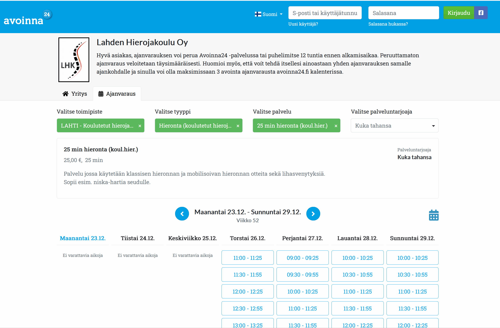

# Avoinna24 women name selection
Using Playwright to make my life easier: select timeslots from only woman massage therapists, based on most common female names in Finland in 2024 (source: [DVV Suosituimmat etunimet](https://dvv.fi/suosituimmat-lasten-nimet))

## Problem
Avoinna24 time booking web app only supports getting the timeslots of the week for all service providers or for 1 service provider.


I want to find available timeslots for _only women_ massage therapists, so using the web site I would have to click on all possible female names. For a big site like Lahden hierojakoulu, this means a lot of manual clicks.

## Solution
Web scraper for Avoinna24 using Playwright to select woman names one-by-one, and print to console their available timeslots for the current week:
```
CSV file processed successfully. Checking against 1000 women names in Finland
---------------------------------
Valittu toimipiste: LAHTI - Koulutetut hierojat (B-Karjalankatu 45)
Valittu tyyppi: Hieronta (koulutetut hierojat)
Valittu palvelu: 25 min hieronta (koul.hier.)
:(  Nina  Vesterinen: No slots available
:(  Sinna Olkkola: No slots available
:(  Kiira Kinnunen: No slots available
:(  Veera Harinen: No slots available
:)  Pauliina Tiirikainen:
    First 5 slots:
        Perjantai 27.12.: 09:00 - 09:25
        Perjantai 27.12.: 09:30 - 09:55
        Perjantai 27.12.: 10:00 - 10:25
        Perjantai 27.12.: 10:30 - 10:55
        Perjantai 27.12.: 11:00 - 11:25
...and 21 more on https://avoinna24.fi/lahdenhierojakoulu/reservation
:(  Milla Mörsky: No slots available
:)  Katariina Repo:
    First 5 slots:
        Lauantai 28.12.: 11:00 - 11:25
        Lauantai 28.12.: 11:30 - 11:55
        Lauantai 28.12.: 12:00 - 12:25
        Lauantai 28.12.: 12:30 - 12:55
        Lauantai 28.12.: 13:00 - 13:25
...and 11 more on https://avoinna24.fi/lahdenhierojakoulu/reservation
:(  Mira Karilahti, opettaja: No slots available
```